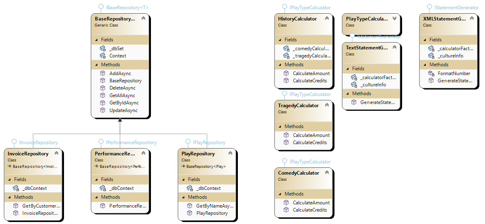

# Theatrical Play Statement API
This application is used by a theater company to generate printed statements from their clients' invoices. The billing is based on the number of lines in each play presented, the size of the audience, and the genre of the play, which currently includes tragedy and comedy. For each presentation, credits are generated as a loyalty mechanism, allowing clients to obtain discounts on future presentations.

# Technologies
- Swagger;
- C#/.NET;
- ASP.NET;
- PostgreSQL;

# Architectural approaches
This application approaches considering Design Patterns, DDD, SOLID principles. Implementation of asynchronous processing of statements, REST and API auto-documentation using Swagger. Finally, data persistence using PostgreSQL.

# Diagram
## Infrastructure

# How to Run
1. Install [PostgreSQL](https://www.postgresql.org/download/);
2. Open this .sln file using Visual Studio 2019 or higher, selecting TheatricalPlayersRefactoringKata.API as startup project and run (F5).

# Future improvements
Dockerize the application (API). However, due to technical limitations of how EntityFramework handles DB.Context.Migrate() it is going to be necessary to manage database creation with raw SQL queries or ADO.NET.